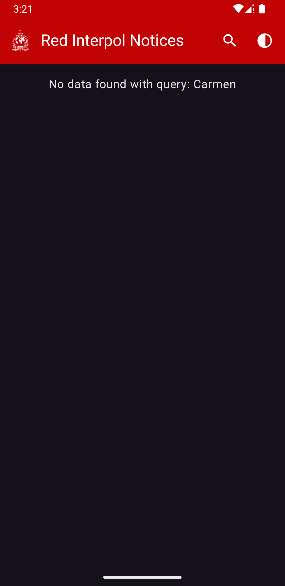

# JetChallenge-InterpolNotices

## Overview

This project demonstrates an Android app using the Model-View-Intent (MVI) pattern to display
Interpol Notices (Currently Red), but in future there is a plan to support Yellow and more notices.

## Features

🚀 This project follows the MVI architecture and incorporates the following key features:

- Display Red Interpol Notices on a List screen
- Display Interpol Notice detail on a Detail screen
- Search Interpol Notices by a keyword
- Supports Offline caching for country codes
- Interactive Error Handling
- Supports Dark/Light mode
- Paginate Notice Detail images and zoom support

## Screenshots

<table>
  <tr>
    <td><h3>Light</h3></td>
    <td></td>
    <td></td>
    <td></td>
    <td></td>
    <td></td>
    <td></td>
    <td></td>
  </tr>
    <tr>
      <td><h3>Dark</h3></td>
    <td></td>
    <td></td>
    <td></td>
    <td></td>
    <td></td>
    <td></td>
    <td></td>
  </tr>
</table>

## Considered Technical stacks

- SOLID Principles
- MVI Clean Architecture
- Dependency Injection with Dagger-Hilt
- Ui component construction with Jetpack Compose framework and Material3
- Use of kotlin flow to handle async data over coroutines
- Retrofit for REST API calls
- DataStore for data persistence
- Glide for image loading and caching
- Partial unit test with Mockk

### Libraries

- Kotlin + DSL
- Coroutines
- Flow
- Dagger-Hilt
- Retrofit
- Jetpack Compose
- Navigation
- Etc.

## Architecture

The selected architecture is Model-View-Intent (MVI) which is widely used in modern Android
development,
especially with Kotlin and Jetpack Compose. It is an evolution of the Model-View-ViewModel (MVVM)
architecture,
designed to handle complex UIs and state management in a predictable and unidirectional data flow.

**Key Components**

- Model: Represents the data structure of an Interpol Notice (e.g., InterpolNotice), and provides
  data access (e.g., fetching from their official repository).
- View: The UI components, jetpack composable that display data and send user actions (intents).
- Intent: The user actions (e.g., a button click/side effects to fetch notices).
- ViewModel: Acts as the presenter, processing user actions and fetching data.

### Testing

Partial classes of certain modules have been tested with Mockk but requires time to extend
coverage

### Future Improvement

- Add more Unit/Ui test
- Add Filter and Sort options
- Save paginated data in Room database or similar
- Etc.
